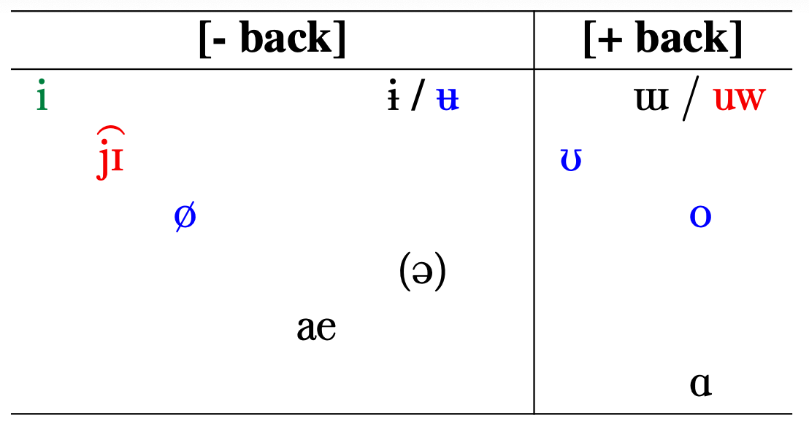
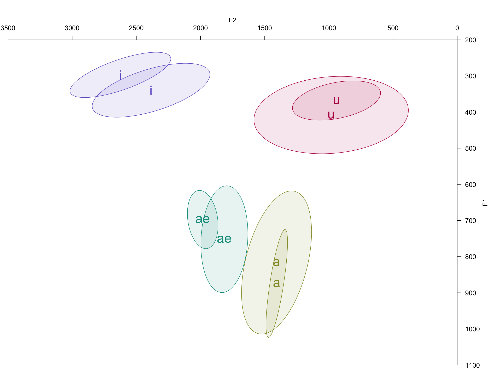

```{r setup, include = FALSE}
library("papaja")
```

```{r analysis-preferences}
# Seed for random number generation
set.seed(42)
knitr::opts_chunk$set(cache.extra = knitr::rand_seed)
```

```{r}
#| label: source
#| warning: False
#| message: False
library("here")
source(here("scripts", "script.R"))
```

# Small Background
An apology to begin with, the current project is based on writer's native language knowledge. Thus, we leave the theoretical support for future investigations. Although Professor Casillas has told the writer that what we are working on is related to *phonetic drift*, we skipped the theoretical framing due to the time limit. The whole project comes from a phenomenon, in which a bilingual speaker's second language affects their mother tongue. 

More specifically, our **research question** focuses on that, in a certain language (Kazakh here), is the vowel pronunciation of speakers of this language affected if the speaker is bilingually proficient in another language (Mandarin here), compared to that of monolingual Kazakh speakers?

Here a **bilingual speaker** in this project, refers to a speaker who is able to natively speak Kazakh and has native-like proficiency in Mandarin Chinese. In contrast, a **monolingual speaker** speaks Kazakh natively, but their proficiency in Mandarin Chinese is NOT native-like. In addition, by **vowel frame**, we refer to the furthest vowels in the vowel plot in a language. In **Figure 1**, the left figure is comparing vowels in Kazakh and Mandarin Chinese, with vowels in the latter vowel higher and more front.

```{r, results='asis', echo=FALSE}
cat('
\\begin{figure}[ht]
\\centering
\\begin{minipage}{0.48\\textwidth}
  \\includegraphics[width=\\linewidth]{finalimages/vowels2.png}
\\end{minipage}
\\hfill
\\begin{minipage}{0.40\\textwidth}
  \\includegraphics[width=\\linewidth]{finalimages/vowels3.png}
\\end{minipage}
\\caption{Kazakh and Mandarin Vowel Frame.}
\\end{figure}
')
```

Our hypotheses come from the right figure in **Figure 1**. Namely, the vowel pronunciations of a bilingual speaker will be affected by Mandarin Chinese. Hence, the vowel frame of bilingual speakers (blue dashed line) is closer to that of Mandarin Chinese (green solid line). The general hypotheses are described below and these hypotheses are applicable to all vowels of bilingual speakers.

**H0**: There is **no difference** between vowels of monolingual and bilingual speakers.

**H1**: Vowels of bilingual speakers will be assimilated to those in **Mandarin Chinese** compared to monolingual **Kazakh** speakers.

If the null hypothesis (H0) is rejected, we turn to the alternative hypothesis (H1), claiming that vowels of bilingual speakers is deviating from those of monolingual speakers.

# Methods
**Vowel Frame** of a language is, in fact, the simplified vowel plot of a certain language, which only depicts the furthest vowels in the vowel plot. More specifically, the vowels are plotted in terms of their F1 and F2, with the former describing the vowel height and the latter, the vowel backness. Although two languages might share the same vowel on phonological aspects, their phonetic values (F1 and F2) might be slightly different, which is shown in Figure 1, the case of Mandarin Chinese and Kazakh. Accordingly, when vowel frames of two languages are compared, F1 and F2 of a vowel are picked out separately and the comparison is on each vowel in two languages.

Four vowels ([i], [æ], [a] and [u]) are shared by Kazakh and Mandarin Chinese and each of them marks one of the vertexes in the vowel frame. Instead of comparing every vowel, comparing only these four could clarify as well the difference between two vowel frames.

A simple linear model (*lm*) is fit for each vowel's **F1** and **F2**, examing their relationship to the **language ability** of the speaker. Formulas for models are listed below:

**F1 model**: $F_1(V)$ ~ $language ability$ $+$ $gender$ $+$ $generation$

**F2 model**: $F_2(V)$ ~ $language ability$ $+$ $gender$ $+$ $generation$

In each model, the dependent variable $F_1(V)$ (or $F_2(V)$) is a continuous variable and $V$ stands for a vowel to be tested. The main effect $language ability$ is a dicategorical variable ($0$: bilingual speaker; $1$: monolingual speaker). Two other predictors are considered as the control variables, in which, $gender$ is a dicategorical variable ($0$: female; $1$: male) and $generation$ is a dicategorical variable ($0$: elder generation; $1$: younger generation).

## Participants
There are altogether 6 participants and their basic information is listed in Table 1 considering the predictors in both models above. It is rather hard to find bilingual speakers in the elder generation because bilingual education system was established after the younger generation (people who were born after 1990s) started to receive their education. In terms of the values of predictors, the participants are fairly well distributed. For three dicategorical variables, there are $8$ ($2^3$) possible combinations altogether and Table 1 covers 6 out of 8 with each participant being the representative of that combination.

```{r, results = "asis"}
#| label: table1

table1 <- data.frame(
  participants = c("1","2","3","4","5","6"),
  language_ability = c("bilingual", "monolingual", "bilingual", "monolingual", "monolingual", "monolingual"),
  gender = c("male", "male", "female", "female", "female", "male"),
  generation = c("younger", "elder", "younger", "elder", "younger", "younger")
)

apa_table(table1, caption = "Basic information of participants", placement = "H")
```

## Data

Each participant was required to read out each word in the word list (see Appendix) three times. For each word, the participant is asked to pause after every action of pronouncing and all three times were recorded in a row and .wav files were generated for each participant's each three pronunciations of the same word. The word in the wordlist was chosen to cover all 11 vowels (shown in Figure ) that are exhibited as surface vowels in Kazakh. Only monosyllabic and disyllabic words are listed to prevent the word length effect and a disyllabic word is listed only when there is no options for monosyllabic words. 

```{r fig1, fig.cap = "Kazakh surface vowels.", fig.align = "center", out.width = "45%"}

```

Then, segmenting and labelling of each vowel are processed manually in **Praat**, disyllabic vowels are only segmented on the stressed syllable since a monosyllabic word naturally receives the word-level stress. Since Kazakh words can be produced in raising and falling intonation and the vowel length is not contrastive, values for $F_1$ and $F_2$ of each vowel are not values at the mid-point of the segment but the **mean value of ten uniformly spaced points**. These points were extracted automatically via a **python** script. After data cleaning, there are altogether 201 segments extracted successfully their $meanF_1$ and $meanF_2$ and the frequency distribution of vowels in terms of language ability of the participants is shown in Table 2 below. Some data points (one segment of vowel [æ], for instance) were excluded from formant extraction process due to the low quality of the recordings. Note here the data points for the vowel [u] are too little, which leads to an inevitable failure in model fitting. 

```{r, results="asis"}
#| label: table2

table2 <- data.frame(
  language_ability = c("monolingual","bilingual"),
  a = c("24", "52"),  
  æ = c("23", "12"),
  i = c("48", "24"), 
  u = c("12", "6")
)

apa_table(table2, caption = "Vowel frequency and language ability.", placement = "H")
```

## Descriptive Statistics

The title *Descriptive Statistics* may not precisely reflect the content of this section, as we do not present summary tables or numeric statistics. Instead, we provide vowel frames for each participant and an aggregated vowel frame grouped by language ability. We believe these visualizations sufficiently capture the relevant patterns in the data and serve the purpose of describing the dataset.

```{r fig3}
#| label: vp3
#| out_width: "90%"
#| fig-asp: 0.5
#| fig-cap: Vowel frame by participants.
#| warning: false
#| message: false

vp3
```

Again, the vowel [u] is not properly depicted in each plot since there are only a few data points for this vowel. The writer cannot recall either why we did not collect more data for this vowel (shame!). However, the main vowel distribution over the plotting area could still be glanced. Vowels of participant 2 seem unstable because he does not feel like recording his voice and all the recordings were done in a low mood, which we cannot control.

```{r fig4, fig.cap = "Vowel frame by language ability.", fig.align = "center", out.width = "70%"}
#| label: vp4

```

Figure 4 depicts these four vowels grouped by participants language ability. From the figure, at least the difference of the vowel [i] and the vowel [æ] between bilingual and monolingual speakers is evident.

# Results
For the sake of space and time, we will only display the two models fit for the vowel [i] and all other models can be found in another R script in the same GitHub repository.

## Model Description
The vowel formant values data were analyzed using a linear model. $F_1$ and $F_2$ were respectively the criterion of $F_1(i)$ model and $F_2(i)$ model both with language ability (bilingual/monolingual) as the predictor and with gender (female/male) and generation (elder/younger) as the control factors. Since there is only one main effect, the nested model comparison is redundant. Experiment-wise alpha was set at 0.05.


## Interpretation
According to Table 3, the model fits well ($F(3)=64.96$; $p<0.001$, $R^2=0.74$) and it explains 73% of the variance. Then according to Table 4, there was a main effect of participants language ability ($t=7.64$; $p<0.001$). Both control factors are statistically significant ($t=3.80$; $p<0.001$ and $t=-11.69$; $p<0.001$). Overall, $F_1$ values of monolingual and bilingual speakers are significantly different. More specifically, monolingual speakers showed an elevation in $F_1$ value of [i] approximately 56.60 +/- 7.41 se, compared to bilingual speakers. This claims that monolingual speakers' vowel [i] is lower than bilingual speakers.

```{r, results="asis"}
#| label: table3&4

table3 <- glance(sf1i)
table4 <- tidy(sf1i)

apa_table(table3, caption = "Model fit of F1 model for the vowel [i].", placement = "H")
apa_table(table4, caption = "Coefficients of F1 model for the vowel [i].", placement = "H")
```

According to Table 5, the model fits well ($F(3)=81.12$; $p<0.001$, $R^2=0.78$) and it explains 78% of the variance. According to Table 6, there was a main effect of participants language ability ($t=-4.28$; $p<0.001$). Both control factors are statistically significant ($t=2.96$; $p<0.001$ and $t=-13.80$; $p<0.001$). Overall, $F_2$ values of monolingual and bilingual speakers are significantly different. Namely, monolingual speakers showed a reduction in $F_2$ value of [i] approximately 177.39 +/- 41.47 se, compared to bilingual speakers. This claims that monolingual speakers' vowel [i] is more back than bilingual speakers.

```{r, results="asis"}
#| label: table5&6

table5 <- glance(sf2i)
table6 <- tidy(sf2i)

apa_table(table5, caption = "Model fit of F2 model for the vowel [i].", placement = "H")
apa_table(table6, caption = "Coefficients of F2 model for the vowel [i].", placement = "H")

```

Although omitted here, models for vowel [æ] and vowel [a] show the same result. Models for the vowel [u] failed to fit since we lack enough data. Yet, an overconfident conclusion would be that this vowel of bilingual speakers should be assimilated to Mandarin Chinese.

# Discussion

This study examined whether bilingual Kazakh-Mandarin speakers produce vowels differently from monolingual Kazakh speakers. While the analysis included four vowels: [i], [a], [æ], and [u], only the results for [i] are reported here due to space limitations. For [i], monolingual speakers showed a significantly higher $F_1$ and lower $F_2$, suggesting a lower and more back articulation compared to bilinguals. This pattern rejects the null hypothesis and supports the idea that bilingual speakers’ vowel production is influenced by Mandarin Chinese, potentially reflecting phonetic drift. The vowel pronunciation of bilingual speakers is assimilated to Mandarin vowels, compared to monolingual speakers.

Although gender and generation also contributed significantly to formant variation, the effect of language ability remained clear. Limited data for some vowels (especially [u]), as well as a small participant pool, constrain the generalizability of our findings. Nonetheless, the observed patterns provide preliminary evidence that bilingualism affects vowel articulation in Kazakh. Future studies should expand the sample size and report full model results for all vowels.


\newpage

# Appendix

## Appendix I Word List
```{r fig-wordlist, results='asis', echo=FALSE}
cat('
\\begin{figure}[ht]
\\centering
\\begin{minipage}{0.48\\textwidth}
  \\includegraphics[width=\\linewidth]{finalimages/wordlist1.png}
\\end{minipage}
\\hfill
\\begin{minipage}{0.48\\textwidth}
  \\includegraphics[width=\\linewidth]{finalimages/wordlist2.png}
\\end{minipage}
\\caption{Wordlist used in the project.}
\\end{figure}
')
```

