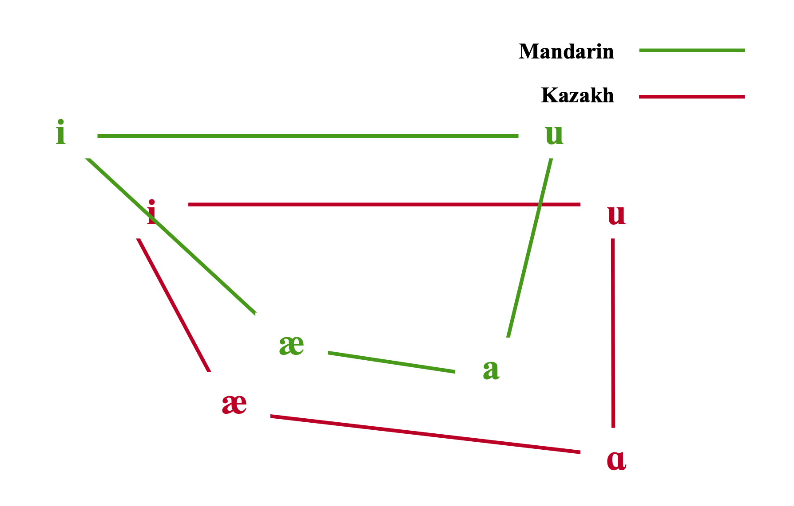
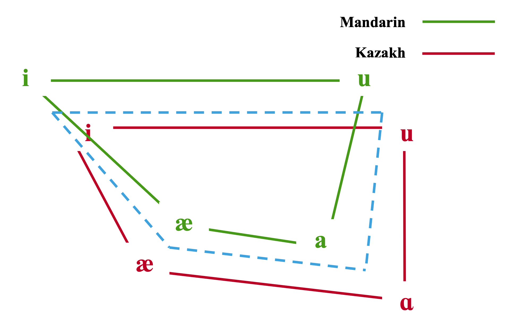
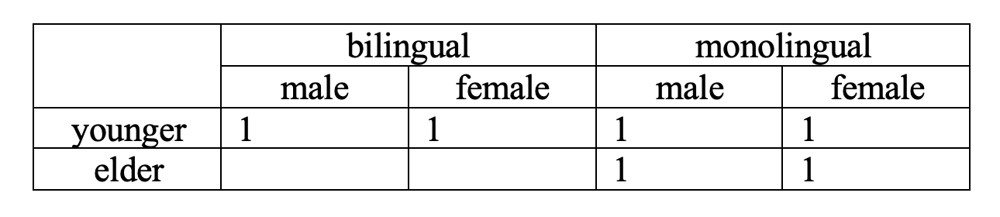
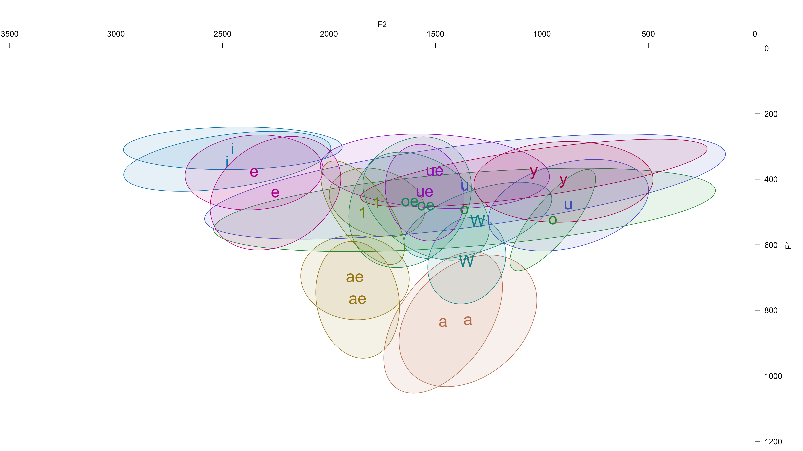
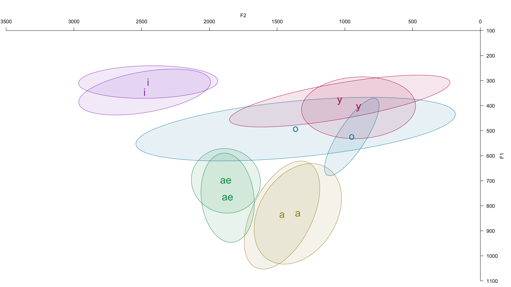
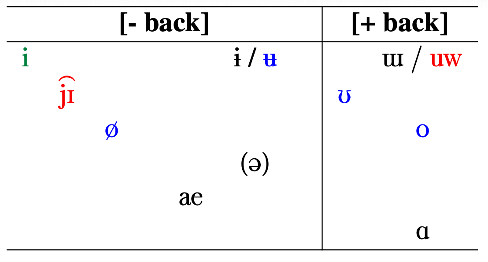
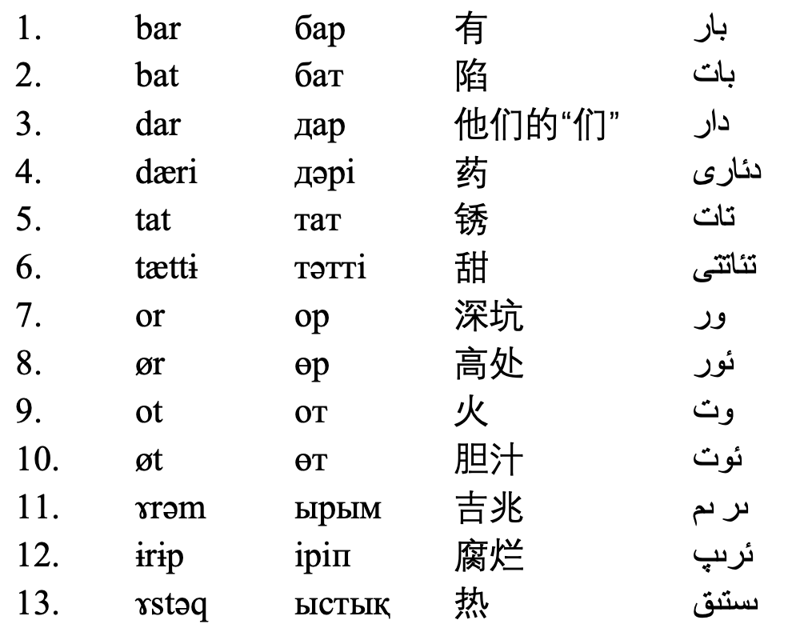
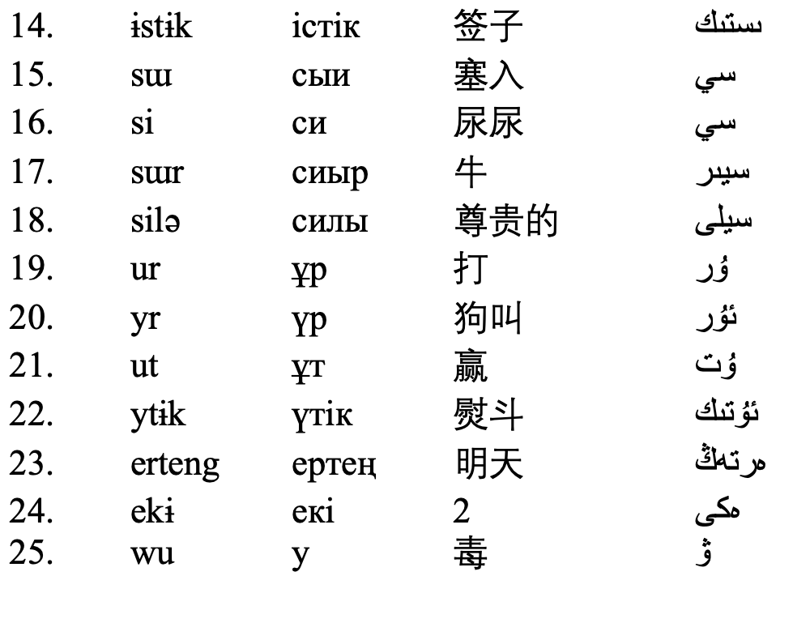

# Research Question

### Basically, I have no theoretical stand or support, SORRY!
 
### But it comes from a phenomenon, in which a bilingual speaker's **second language** affects their **mother tongue**.
 
### In a certain language (**Kazakh** here), is the **vowel** pronunciation of speakers of this language affected if the speaker is **bilingually** proficient in another language (**Mandarin** here), compared to that of **monolingual** speakers?

---
# Kazakh and Madarin Vowels (non-exaustive)

---
# Hypotheses

###**H0**: There is **no difference** between vowels of monolingual and bilingual speakers.
 
###**H1**: Vowels of bilingual speakers will be **assimilated** to those in their second language compared to monolingual speakers.

---
# Hypotheses

---
# Hypotheses

###**H0**: There is **no difference** between vowels of monolingual and bilingual speakers.
 
###**H1**: Vowels of bilingual speakers will be **assimilated** to those in their second language compared to monolingual speakers.

 
## We should have sub-hypotheses as well:

###**H1a**: The vowel [i] of bilingual speakers is higher/more front than that of monolingual speakers.

###...

---
#Participants

### **number**: 6

### **gender**: 3 male, 3 female

### **generation**: 4 younger, 2 elder

### **proficiency**: 2 bilingual, 4 monolingual

---
#Data

### All data were collected previously (3 years ago) for Merlin's Master Thesis. I have never properly used this dataset.

### Every participant were asked to pronounce a word three times, the word list contain words that are either **monosyllabic** or **disyllabic**.

### To avoid the affect of stress, only the stressed syllable is considered in every disyllabic word.

### In total, 25 words, containing 11 vowels of Kazakh. **Pratt** was used for segmenting and labelling; **Python** for extracting formants; and **R** for the rest.

---
class: middle
#Methods

### F1(V) ~ proficency + gender + generation

### F2(V) ~ proficency + gender + generation

---
# Quick Descriptive Statistics

---
# Quick Descriptive Statistics

---
# Vowel Inventory and Word List

---
# Vowel Inventory and Word List

---
class: center, middle

# Thank You for Listening!

### Slides created via the R package [**Xaringan**](https://github.com/yihui/xaringan).
